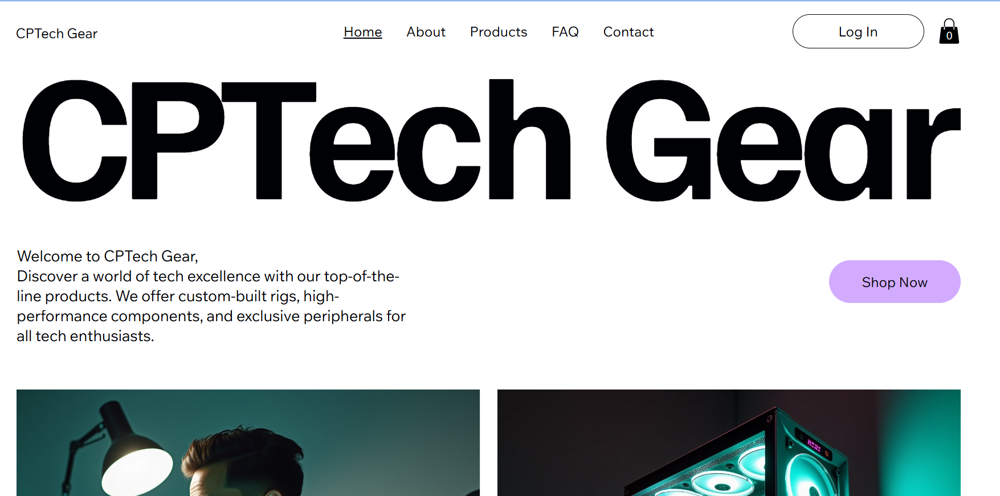
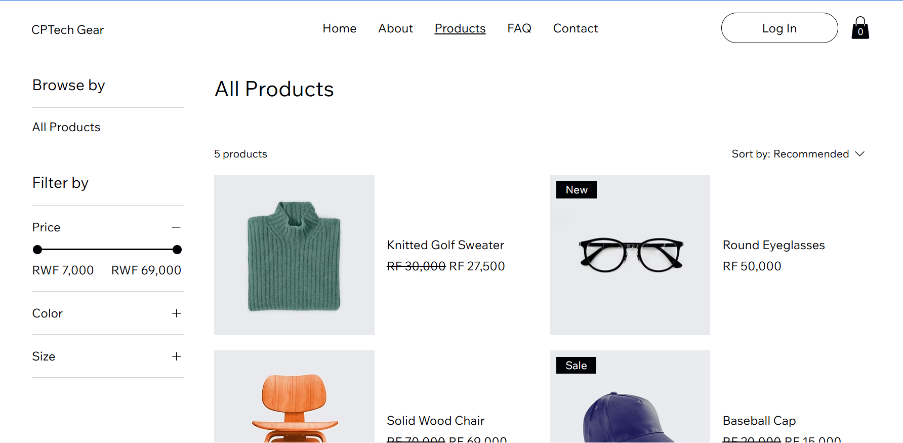
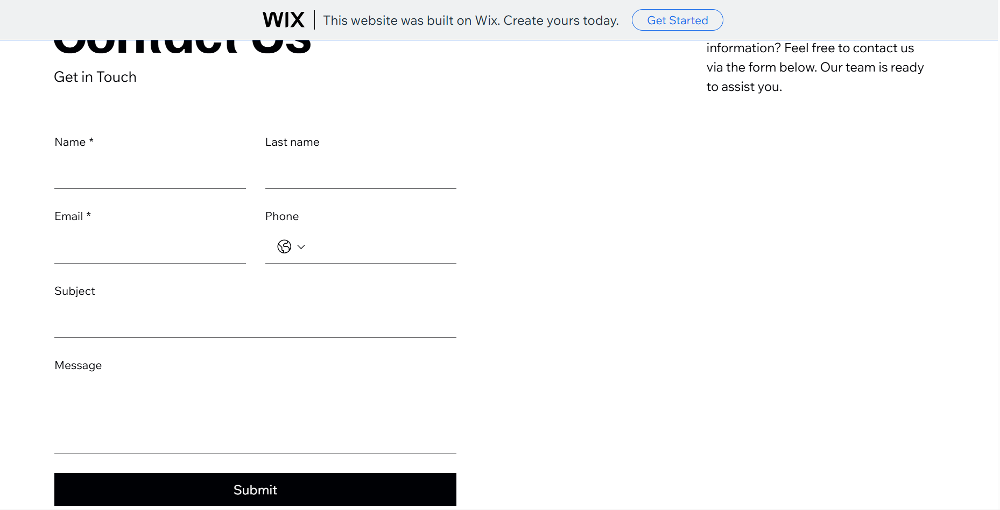
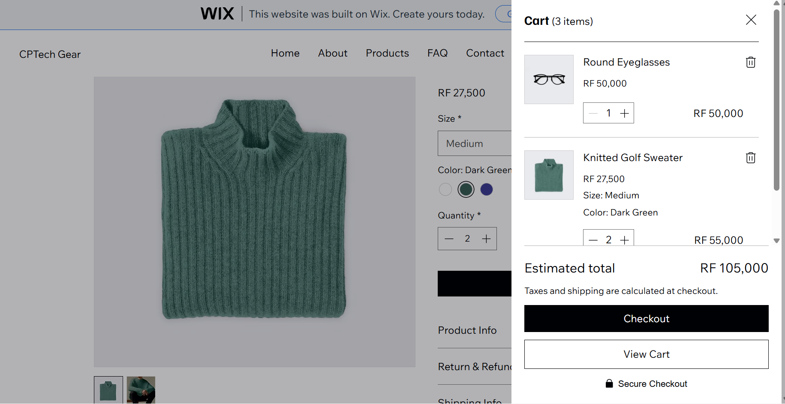

# UNILAK E-Commerce Application Design Project

## Student Information
* **Name:** Pacifique CYUZUZO
* **Registration Number:** 24004/2024
* **Faculty:** Computing and Information Sciences
* **Department:** Software Development
* **Course:** E-Commerce And Web Application Course (EWA408510)
* **Lecturer:** Eric Maniraguha
* **Academic Year:** 2025-2026 | Semester: II

---

## Project Overview
* **Project Title:** CPTech Gear
* **Platform Used:** Wix (No-Code/Low-Code Platform)
* **Live Website Link:** [CPTech Live Store](https://cyuzuzopacifique74.wixsite.com/cptech-24004-2024)
* **GitHub Repository Link:** [https://github.com/Cyuzuzo/CP-Tech-Ecommerce](https://github.com/Cyuzuzo-dot/CPTech-Gear.git)

---

## Features Implemented

### 1. Structure & Pages
* **Homepage:** Displays the store name (**CP-Tech**), a clean tech-themed welcome banner, and a professional call-to-action button to explore the shop.
* **Product Page:** Features an interactive catalog showcasing **5 premium tech items** complete with high-quality images, structured pricing, detailed specifications, and stock availability descriptions.
* **About Page:** Outlines the core mission of CP-Tech, highlighting our dedication to providing affordable, cutting-edge technology solutions to students and professionals.
* **Contact Page:** Features a functional contact form, customer support email, phone details, and an interactive location section.

### 2. User Experience (UI/UX)
* Responsive design optimized for both desktop and mobile web viewports.
* Clear, persistent navigation menu linking all essential store pages.
* Interactive **Cart System** simulation allowing users to add individual items, modify quantities, and access a dynamic sliding mini-cart drawer.

---

## E-Commerce Store Products

| Product Name | Description | Price (RWF) |
| :--- | :--- | :--- |
| **Logitech MX Master 3S** | Ergonomic wireless office mouse with silent clicks and 8K DPI tracking. 
| **Keychron K2 Mechanical Keyboard** | Wireless 75% layout keyboard with tactile Gateron brown switches and RGB lighting.
| **Anker PowerCore 24K** | Ultra-high capacity 140W power bank featuring a smart digital status display. 
| **Sony WH-1000XM5** | Premium wireless noise-canceling over-ear headphones with exceptional audio clarity. 
| **Dell UltraSharp 27" 4K Monitor** | IPS USB-C hub monitor perfect for software development and color-accurate UI/UX design.

---

## Project Screenshots

### Homepage

### Product Page

### Contact 

### Cart 

---

## Challenges
* **Wix Template Constraints:** Modifying layout-specific design frameworks without breaking mobile responsiveness required careful canvas adjustment.
* **Cart Simulation Calibration:** Customizing the behavioral triggers of the cart preview component to ensure intuitive user checkout visual cues without relying on a premium merchant payment setup.

---

## Lessons Learned
* **No-Code Agility:** Learned how to rapidly build, test, and deploy feature-rich web interfaces using modern low-code tools like Wix.
* **UI/UX Visual Hierarchy:** Gained practical insights into positioning call-to-action elements, product categorization layouts, and dynamic navigation schemes to reduce user drop-off rates.
* **Portfolio Documentation:** Understood the professional importance of utilizing structured Markdown within GitHub to present technical deliverables cleanly to stakeholders and academic instructors.
